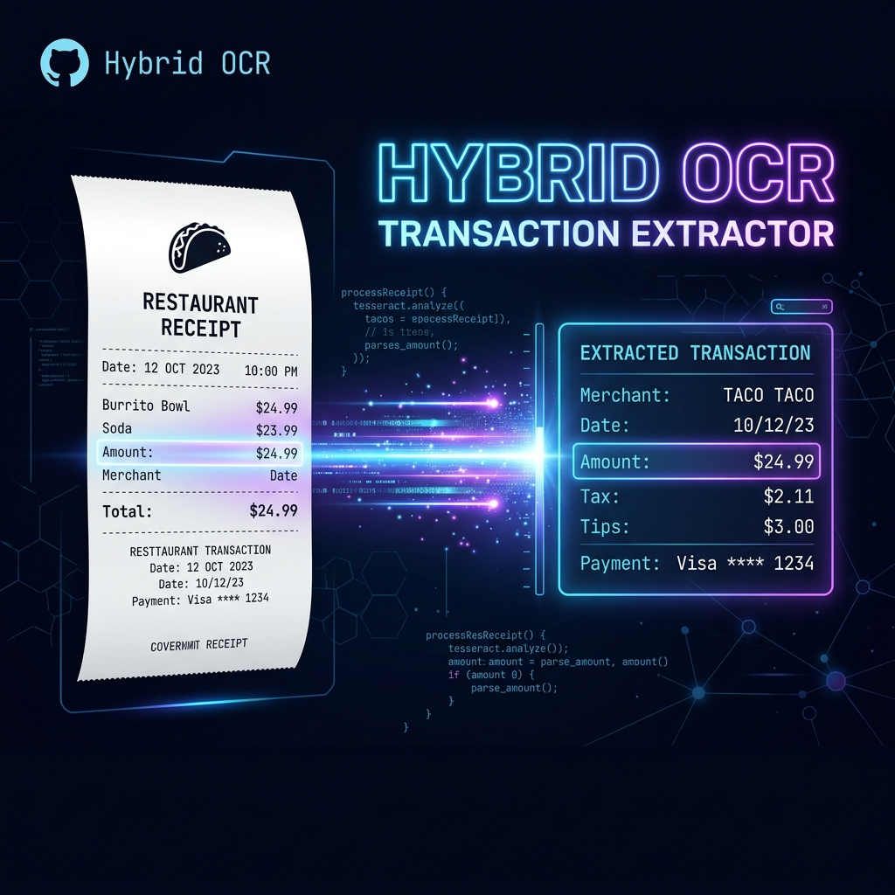
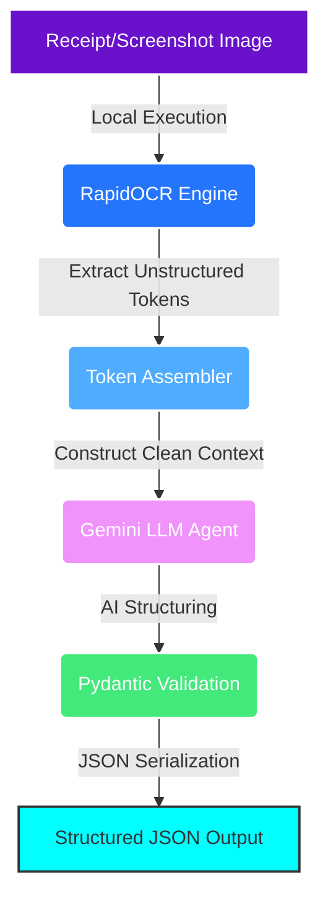

<p align="center">
  
</p>

<h1 align="center">⚡ Hybrid OCR — Transaction Extractor ⚡</h1>

<p align="center">
  <b>A state-of-the-art hybrid pipeline combining local on-device OCR with LLM-based intelligence to parse and structure receipt/screenshot transaction details into validated JSON.</b>
</p>

<p align="center">
  <a href="https://github.com/pawan941394/Hybrid-OCR-Transaction-Extractor/stargazers"></a>
  <a href="https://github.com/pawan941394/Hybrid-OCR-Transaction-Extractor/issues"></a>
  <a href="https://github.com/pawan941394"></a>
  <a href="https://github.com/pawan941394/Hybrid-OCR-Transaction-Extractor/blob/main/LICENSE"></a>
</p>

---

## 📖 Overview

Processing transaction receipts or mobile payment screenshots (e.g., UPI, NetBanking, card payments) often involves noisy backgrounds, low-quality text, and highly variable layouts.

This project implements a **Hybrid Architecture**:
1. **On-Device OCR Engine**: Leverages `RapidOCR` locally to extract raw, unstructured text tokens with precise spatial awareness.
2. **Pydantic AI Agent**: Passes the unstructured text to Gemini (via `pydantic-ai`) to distill it and structure it into a strict schema.
3. **Type-Safe Validation**: Returns a verified `TransactionData` model containing clean fields (amounts, sender/receiver details, payment types, timestamps, reference IDs, and bank names).

---

## 🌀 Workflow



---

## ✨ Key Features

| Feature | Description | Tech Used |
| :--- | :--- | :--- |
| **Local Text Extraction** | Fast, CPU-friendly OCR to capture tokens from screenshots without cloud dependencies. | `RapidOCR`, `onnxruntime` |
| **Type-Safe Validation** | Ensures parsed values conform exactly to the expected data structures. | `Pydantic v2` |
| **LLM-Based Structuring** | Leverages Gemini to handle noisy, out-of-order text tokens and map them to their semantic meaning. | `pydantic-ai`, Gemini Flash Lite |
| **UPI & Bank Parsing** | Extract key transaction data: UTR ID, UPI handles, sender/receiver names, and banks. | Native schemas |

---

## 🛠️ Tech Stack & Dependencies

- **Core**: Python 3.11+
- **OCR Engine**: [RapidOCR](https://github.com/RapidAI/RapidOCR)
- **AI Agent**: [Pydantic AI](https://ai.pydantic.dev/) (powered by Gemini)
- **Validation**: [Pydantic v2](https://docs.pydantic.dev/latest/)
- **Environment Management**: `python-dotenv`

---

## 🚀 Getting Started

### 1. Clone the Repository
```bash
git clone https://github.com/pawan941394/Hybrid-OCR-Transaction-Extractor.git
cd Hybrid-OCR-Transaction-Extractor
```

### 2. Environment Setup & Installation
Using virtual environment is recommended:

```bash
# Create and activate virtual environment
python -m venv .venv
# On Windows:
.venv\Scripts\activate
# On macOS/Linux:
source .venv/bin/activate

# Install dependencies
pip install -r requirements.txt
```

### 3. API Key Configuration
Create a `.env` file in the root directory:
```env
GOOGLE_API_KEY=your_gemini_api_key_here
```
> [!NOTE]
> You can obtain a free Gemini API Key from Google AI Studio.

---

## 💻 Usage

Run the transaction extractor using the default image (`1.jpeg`):

```bash
python main.py
```

### Output Example
The program will run the OCR locally, process it through the LLM, and print the parsed output:

```json
{
  "status": "success",
  "amount": 1500.0,
  "sender_name": "John Doe",
  "sender_upi": "johndoe@okaxis",
  "receiver_name": "Store XYZ",
  "receiver_upi": "storexyz@okicici",
  "bank": "Axis Bank",
  "timestamp": "2026-06-10 14:32:00",
  "reference_id": "123456789012",
  "payment_type": "sent",
  "utr_id": "606101432001"
}
```

---

## 👥 Connect With Me

Let's collaborate! You can reach out to me via these platforms:

<p align="center">
  <a href="https://github.com/pawan941394"></a>
  <a href="https://www.linkedin.com/in/pawan941394/"></a>
  <a href="https://www.youtube.com/@Pawankumar-py4tk"></a>
</p>

---

## ⚖️ License

Distributed under the MIT License. See `LICENSE` for more information.

<p align="right">(<a href="#top">back to top</a>)</p>
